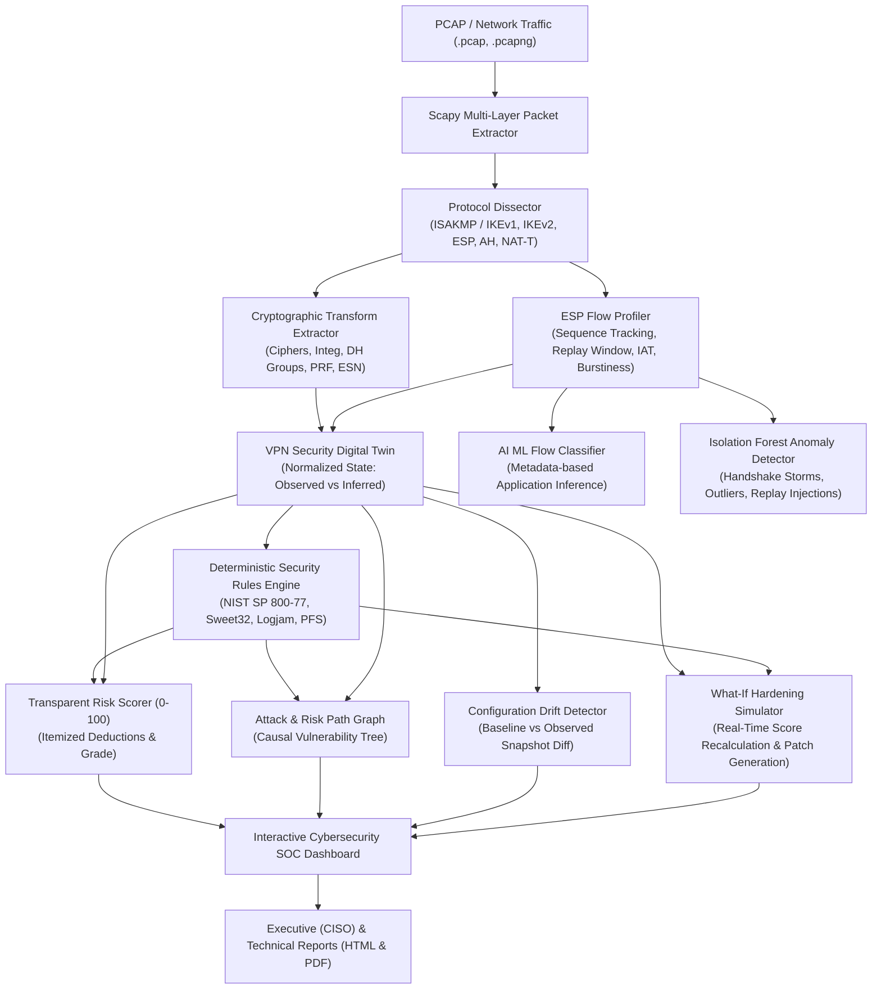

# 🛡️ IPsec Sentinel — AI-Powered IPsec VPN Security Intelligence Platform

[]()
[]()
[]()
[]()

> **Smart India Hackathon (SIH) Prototype: AI-assisted defensive security platform that analyzes IPsec VPN packet captures, reconstructs VPN security digital twins, detects cryptographic regressions, infers encrypted application behavior, and powers what-if hardening simulations.**

---

## 📌 Executive & Technical Overview

IPsec Sentinel operates as a **VPN Security Digital Twin & AI Security Assessment Engine**. It ingests raw packet captures (`.pcap`, `.pcapng`, `.cap`) or live telemetry, performs deterministic protocol header decoding (IKEv1, IKEv2, ESP, AH), evaluates cryptographic resilience against NIST and NSA CNSA standards, detects operational anomalies via Isolation Forest models, and enables real-time **What-If Hardening Simulations** with auto-generated strongSwan / swanctl deployment patches.



---

## 🌟 Key Features

### 1. Packet-Level IKE & ESP Dissection (Scapy Native Engine)
- **Zero Hallucination Guarantee**: Every observed transform is traceable to exact packet indices, hex bytes, and IANA transform IDs.
- **Strict Classification**: Explicitly distinguishes between **OBSERVED** (directly decoded from payloads), **INFERRED** (statistical flow heuristics), and **UNKNOWN**.
- Decodes IKEv1 (Main & Aggressive mode), IKEv2 (IKE_SA_INIT, IKE_AUTH, CREATE_CHILD_SA), UDP/500, UDP/4500 (NAT-T Non-ESP marker and UDP-encapsulated ESP), IP protocol 50 (ESP), and Protocol 51 (AH).

### 2. VPN Security Digital Twin
- Reconstructs gateway endpoints (Initiator IP:port $\leftrightarrow$ Responder IP:port).
- Maps active Security Associations (SAs), SPI tables, and sequence number progressions.
- Reconstructs cryptographic suites: Cipher, Block/Stream mode, Integrity transform, Diffie-Hellman group, PFS status, and SA lifetimes.

### 3. Transparent & Deterministic Risk Scoring (0–100)
- **Base Score: 100 points**. Transparent itemized deductions with explicit cryptanalytic reasons:
  - Broken Single DES: **-30 pts** (Critical)
  - Insecure DH Group 1 / 2 (Logjam vulnerability): **-25 pts** (Critical)
  - 3DES-CBC (Sweet32 64-bit block collision): **-20 pts** (High)
  - Perfect Forward Secrecy (PFS) Disabled: **-15 pts** (High)
  - Deprecated IKEv1 Protocol: **-15 pts** (High)
  - Broken HMAC-MD5 Integrity: **-15 pts** (High)
  - Inactive Anti-Replay / Duplicate Sequences: **-20 pts** (Critical)
  - Excessive SA Lifetime (>28,800s): **-8 pts** (Medium)
- Assigns objective posture grades: **A+ (95–100), A (85–94), B (70–84), C (55–69), D (40–54), F (<40)**.

### 4. Configuration Drift Detection
- Compares active tunnel snapshot against an authorized golden baseline or previous fingerprint.
- Instantly detects and alerts on silent downgrades:
  - Cipher downgrade: `AES-256-GCM` $\rightarrow$ `AES-128-CBC`
  - DH Group weakening: `Group 19 (ECP-256)` $\rightarrow$ `Group 14 (MODP-2048)`
  - Forward Secrecy regression: `PFS Enabled` $\rightarrow$ `PFS Disabled`
- Itemizes changed parameters, previous vs current values, severity, and security implications.

### 5. What-If Hardening Simulator (Signature Feature)
- Analysts can tweak prospective parameters (IKEv2, AES-256-GCM, DH-19, PFS ON, Rekey interval).
- Dynamically recalculates the security posture in real-time.
- Shows:
  - Current Score vs Projected Score (e.g., $17/100 \rightarrow 98/100$, $+81$ pts improvement)
  - Resolved Findings list (which vulnerabilities disappear upon remediation)
  - Auto-generated, copy-pasteable **strongSwan (`swanctl.conf`)** configuration patch.

### 6. AI Encrypted Traffic Classification & Privacy Analysis
- **Research/Demo Classifier**: Estimates tunneled application behavior (*Video Streaming, Web Browsing, VoIP Audio, Bulk Backup, ICMP Diagnostic*) based strictly on statistical flow metadata (*packet size distributions, inter-arrival times, burstiness index, and directionality*).
- **Mandatory Ethical Disclaimer**: Explicitly states that traffic inference is purely metadata-based; **no payloads are decrypted**.
- **Metadata Exposure Score**: Quantifies resistance against passive side-channel traffic analysis (RFC 4303 Traffic Flow Confidentiality / TFC).

### 7. Isolation Forest Anomaly Detection
- Detects multi-dimensional statistical deviations:
  - Repeated handshake floods / IKE renegotiation storms
  - Duplicate 32-bit sequence numbers (in-flight replay attacks or window corruption)
  - Abnormal Security Association churn (excessive distinct SPIs)
- Labels deviations neutrally: *"Potentially anomalous behavior requiring investigation."*

### 8. Interactive Attack & Risk Path Graph
- Visualizes cause-and-effect compound vulnerabilities:
  $$\text{Weak DH Group 2} \xrightarrow{\text{enables}} \text{Logjam Discrete Log Break} + \text{PFS Disabled} \xrightarrow{\text{enables}} \text{Retrospective Bulk Decryption}$$
- Clickable nodes with in-depth cryptanalytic explanations.

### 9. Multi-Format Audit Reports
- **Executive Report (HTML & PDF)**: Tailored for CISOs and management with risk ratings, business impact, and strategic priorities.
- **Technical Report (HTML & PDF)**: Full audit trail for SOC engineers including transform IDs, packet counters, sequence analysis, and strongSwan patches.

---

## 🗂️ Project Architecture

```text
d:\ipsec/
├── backend/
│   ├── app/
│   │   ├── main.py                  # FastAPI entrypoint & lifespan
│   │   ├── api/
│   │   │   └── routes.py            # REST API endpoints
│   │   ├── models/
│   │   │   └── schemas.py           # Pydantic data schemas
│   │   ├── analyzers/
│   │   │   ├── pcap_analyzer.py     # Scapy PCAP reader orchestrator
│   │   │   ├── ike_parser.py        # IKEv1/IKEv2 payload & transform dissector
│   │   │   └── esp_parser.py        # ESP sequence & flow statistical analyzer
│   │   ├── ml/
│   │   │   ├── feature_extractor.py # Flow & timing statistics
│   │   │   ├── protocol_classifier.py# Random Forest Tunnel vs Transport
│   │   │   ├── traffic_classifier.py# Encrypted application metadata classifier
│   │   │   └── anomaly_detector.py  # Isolation Forest anomaly detector
│   │   ├── security/
│   │   │   ├── baseline.py          # Configurable security baselines
│   │   │   ├── rules_engine.py      # Deterministic NIST compliance rules
│   │   │   ├── risk_scorer.py       # Transparent 100-point scoring engine
│   │   │   ├── risk_graph_builder.py# Attack/risk causal tree builder
│   │   │   ├── drift_detector.py    # Configuration drift diff engine
│   │   │   ├── whatif_simulator.py  # Hardening simulator & patch generator
│   │   │   └── privacy_analyzer.py  # Encrypted metadata side-channel scorer
│   │   ├── database/
│   │   │   └── db.py                # SQLite persistence
│   │   ├── reports/
│   │   │   └── report_generator.py  # HTML & ReportLab PDF generators
│   │   └── utils/
│   │       ├── constants.py         # IANA transform mappings & DH registry
│   │       └── synthetic_generator.py# Scapy PCAP generator script
│   ├── tests/
│   │   └── test_sentinel.py         # Pytest automated test suite
│   ├── requirements.txt
│   └── Dockerfile
├── frontend/
│   ├── src/
│   │   ├── components/              # SOC UI modules
│   │   │   ├── Navbar.tsx
│   │   │   ├── DemoSelector.tsx
│   │   │   ├── FileUpload.tsx
│   │   │   ├── VPNOverviewCards.tsx
│   │   │   ├── DigitalTwinView.tsx
│   │   │   ├── FindingsList.tsx
│   │   │   ├── ScoreBreakdownCard.tsx
│   │   │   ├── RiskGraphView.tsx
│   │   │   ├── WhatIfSimulatorView.tsx
│   │   │   ├── EncryptedTrafficView.tsx
│   │   │   ├── MetadataPrivacyView.tsx
│   │   │   ├── DriftView.tsx
│   │   │   ├── TrafficAnalyticsCharts.tsx
│   │   │   └── ReportsModal.tsx
│   │   ├── services/
│   │   │   └── api.ts               # Backend REST API client
│   │   ├── types/
│   │   │   └── index.ts             # TypeScript interface contracts
│   │   ├── App.tsx                  # Main dashboard controller
│   │   └── index.css                # Tailwind CSS v4 & theme
│   ├── package.json
│   ├── vite.config.ts
│   └── Dockerfile
├── data/
│   └── sample_pcaps/                # Pre-packaged controlled datasets
│       ├── strong_vpn.pcap
│       ├── weak_crypto_vpn.pcap
│       ├── config_drift_vpn.pcap
│       ├── anomalous_vpn.pcap
│       └── legacy_vpn.pcap
├── docker-compose.yml
└── README.md
```

---

## ⚡ Quickstart & Local Setup

### Prerequisites
- Python 3.11+
- Node.js v20+ / npm v10+

### Option 1: Running Locally

#### 1. Setup Backend
```bash
cd backend
python -m venv ../venv
# On Windows:
..\venv\Scripts\activate
# On Linux/macOS:
# source ../venv/bin/activate

pip install -r requirements.txt

# Generate sample controlled PCAPs:
python -m app.utils.synthetic_generator

# Run test suite:
pytest -v tests/test_sentinel.py

# Launch FastAPI backend:
uvicorn app.main:app --host 127.0.0.1 --port 8000 --reload
```
Backend API will be accessible at: `http://127.0.0.1:8000` (Docs: `http://127.0.0.1:8000/docs`).

#### 2. Setup Frontend
```bash
cd frontend
npm install
npm run dev -- --host 127.0.0.1 --port 5173
```
Open your browser to: **`http://127.0.0.1:5173`**

---

### Option 2: Docker Compose
```bash
docker-compose up --build
```
- Dashboard: `http://localhost:3000`
- API Backend: `http://localhost:8000`

---

## 🧪 Controlled Laboratory Test Datasets

The platform includes 5 pre-packaged laboratory PCAPs generated via Scapy with authentic cryptographic and packet structures:

| Sample Name | Target Trace | Scenario & Weakness Profile | Expected Score |
| :--- | :--- | :--- | :--- |
| **Strong Modern VPN** | `strong_vpn.pcap` | IKEv2, AES-256-GCM AEAD, DH-19 (ECP-256), PFS Enabled, Replay Protected | **100/100 (Grade A+)** |
| **Weak Crypto VPN** | `weak_crypto_vpn.pcap` | IKEv1, 3DES-CBC (Sweet32), HMAC-MD5, DH Group 2 (Logjam), PFS Disabled | **17/100 (Grade F)** |
| **Configuration Drift** | `config_drift_vpn.pcap` | Silent downgrade: AES-128-CBC, DH-14, PFS Disabled against golden baseline | **82/100 (Grade B, 2 Regressions)** |
| **Anomalous Negotiation Storm** | `anomalous_vpn.pcap` | 20+ rapid IKE renegotiations, in-flight duplicate ESP sequence numbers | **80/100 (Grade B, 2 Anomalies)** |
| **Legacy DES VPN** | `legacy_vpn.pcap` | Broken 56-bit Single DES, 768-bit DH Group 1, deprecated IKEv1 protocol | **15/100 (Grade F)** |

---

## 🎬 Step-by-Step Demonstration Flow (SIH Judge Walkthrough)

Follow this exact walkthrough during evaluations:

1. **Open the Platform**: Navigate to `http://127.0.0.1:5173`.
2. **Observe Instant Analysis**: The system immediately displays the **Configuration Drift Demo** scenario.
3. **Inspect the Drift Alert**: Note the glowing amber banner: `CONFIGURATION DRIFT DETECTED: 2 Regressions`.
4. **Examine the Digital Twin**: Click the *Digital Twin & Overview* tab. View the Initiator $\leftrightarrow$ Responder IP gateways, active ESP SPIs, and the parameter matrix distinguishing **OBSERVED** vs **INFERRED** parameters.
5. **Review Explainable Findings**: Click the *Security Findings* tab. Notice why AES-128-CBC and lack of PFS were flagged, complete with packet citations and strongSwan configuration fixes.
6. **Explore the Risk Path Graph**: Click the *Attack & Risk Path Graph* tab. View how weak DH primes link with absent forward secrecy to create a compound retrospective decryption threat. Click any node for cryptanalytic insights.
7. **Launch What-If Hardening Simulator**: Click the *What-If Simulator* tab.
   - Change Cipher from `AES-128-CBC` $\rightarrow$ `AES-256-GCM`
   - Change DH Group from `Group 14` $\rightarrow$ `Group 19 (ECP-256)`
   - Toggle PFS to `ENFORCED`
   - Observe the **Projected Score** surge from **82/100 (Grade B)** to **100/100 (Grade A+)**!
   - Review which findings were resolved and click **Copy Configuration** to grab the deployment patch.
8. **Inspect Encrypted Traffic & Privacy**: Click the *Traffic & Privacy* tab. Review the model's traffic classification, the probability distribution, and the **Metadata Exposure Score** with TFC padding recommendations.
9. **Try Another Lab Scenario**: Click **Demo Lab** in the top navigation bar and select **Weak Crypto VPN**. Watch the score plummet to **17/100 (Grade F)** and observe the Sweet32 and Logjam vulnerability alerts.
10. **Export Security Reports**: Click **Reports** in the top bar. Toggle between the **Executive Summary** (for CISOs) and **Technical Audit** (for engineers). Click **Download PDF** to generate an audit-ready PDF document.

---

## 🔒 Security & Ethics Disclosure

IPsec Sentinel is strictly a **defensive network protocol intelligence and hardening platform**. It does **NOT** conduct:
- Unauthorized VPN intrusion or brute-force credential cracking
- Payload decryption or key extraction
- Offensive payload delivery or exploitation

All analyses are conducted on authorized network packet traces and controlled laboratory datasets.

---

## 📄 License
Developed for the **Smart India Hackathon (SIH)**. Distributed under the MIT License.
